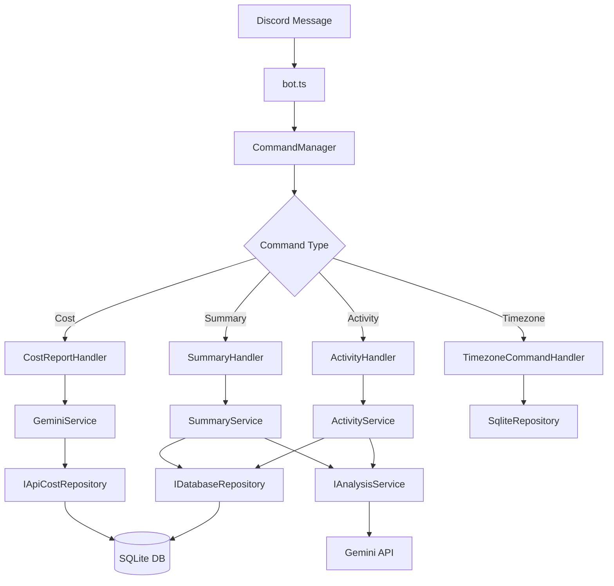

# Discord Task Logger

Discord を使って自然言語で活動記録を管理し、Gemini AI で統合的な解析・サマリー生成を行うタスクロガーです。

## 機能

### 📝 活動記録
- **自然言語ログ方式**: ユーザーの入力をそのまま記録し、AIが統合的に時間配分を分析
- **定期問いかけ**: 平日9:00-18:00に毎時0分・30分にDMで活動記録を促進
- **柔軟な時間表現**: 「14:00-15:30は会議」「いま30分休憩していた」など多様な表現に対応
- **任意タイミング投稿**: リマインダー以外でも、いつでも自由に活動を記録可能
- **編集・削除機能**: `!edit`コマンドで過去の記録を簡単に修正・削除

### 📊 日次サマリー・分析
- **統合分析**: 1日の全活動ログをAIが統合的に分析し、重複や未記録時間を検出
- **リアルタイム分析**: `!summary`コマンドで現在までの活動状況をいつでも確認
- **過去日分析**: `!summary 2025-06-27`形式で過去の特定日を分析
- **自動生成**: 毎日5:00に前日の完全なサマリーを自動送信
- **キャッシュ機能**: 分析結果をキャッシュして高速レスポンス

### 🗄️ データ管理
- **永続化**: 全活動記録を永続的に保存（1投稿=1レコード）
- **SQLite データベース**: 軽量で高速なローカルデータベース
- **業務日管理**: 5:00am基準で日の境界を設定し、正確な日次管理

## セットアップ

### 1. Node.js仮想環境の作成

```bash
# nvmでNode.js仮想環境を作成・使用
nvm install 20
nvm use 20

# または .nvmrc ファイルを使用（推奨）
nvm use

# 現在のNode.jsバージョンを確認（20.x.x である必要があります）
node --version
```

### 2. 環境設定

```bash
# 依存関係のインストール（仮想環境内）
npm install

# 環境変数ファイルの作成
cp .env.example .env
```

### 3. 環境変数の設定

`.env` ファイルを編集：

```env
# Discord Bot設定
DISCORD_TOKEN=your_discord_bot_token_here
DISCORD_CLIENT_ID=your_discord_client_id_here

# Google Gemini API設定
GOOGLE_API_KEY=your_google_gemini_api_key_here

# 対象ユーザーID（DMを送信するユーザー）
TARGET_USER_ID=your_discord_user_id_here

# データベース設定（オプション）
# 開発環境: ./data/tasks.db
# 本番環境: ./data/activity_logs.db
# DATABASE_PATH=./data/tasks.db

# 環境設定
NODE_ENV=development
```

### 4. Discord Bot の作成

1. [Discord Developer Portal](https://discord.com/developers/applications) でアプリケーション作成
2. Bot を作成し、TOKEN を取得
3. 必要な権限を設定:
   - Send Messages
   - Read Message History
   - Use Slash Commands

### 5. Discord Bot をサーバーに招待

1. **招待URLの生成**
   - Discord Developer Portalで作成したアプリケーションページに移動
   - 左側メニューから「OAuth2」→「URL Generator」を選択
   
2. **権限の設定**
   - **SCOPES**: `bot` にチェック
   - **BOT PERMISSIONS**: 以下の権限にチェック
     - **Text Permissions**:
       - Send Messages
       - Send Messages in Threads
       - Read Message History
       - Add Reactions
     - **General Permissions**:
       - Use Slash Commands

3. **招待URLをコピーして使用**
   - 画面下部に生成されたURLをコピー
   - URLをブラウザで開き、Botを招待したいサーバーを選択
   - 管理者権限を持つアカウントで承認

4. **ユーザーIDの取得**
   - Discordで開発者モードを有効化：設定 → 詳細設定 → 開発者モード
   - 自分のユーザー名を右クリック →「ユーザーIDをコピー」
   - コピーしたIDを `.env` ファイルの `TARGET_USER_ID` に設定

### 6. Google Gemini API の設定

1. [Google AI Studio](https://makersuite.google.com/app/apikey) でAPI キーを取得
2. `.env` ファイルに設定

## 使用方法

### 開発環境での起動

```bash
# 開発環境設定で起動
npm run dev

# または watch モードで開発（ファイル変更時に自動再起動）
npm run watch

# 本番環境設定でローカルテスト
npm run dev:prod
```

### 本番環境での起動

```bash
# ビルド
npm run build

# 開発環境設定で実行
npm run start:dev

# 本番環境設定で実行
npm run start:prod
```

### 初回起動後の確認

```bash
# Bot起動後、Discordで以下をテスト
# 1. DMでBotに「テスト」と送信
# 2. !timezone コマンドでタイムゾーン設定
# 3. !summary コマンドで現在の状況確認
```

## 使用方法

### 活動記録の基本的な流れ

1. **定期リマインダー**: Botが30分ごとに自動でDMを送信
2. **自由な投稿**: 活動内容を自然言語で返信（任意タイミングでも投稿可能）
3. **統合分析**: 1日の終わりにAIが全ログを統合的に分析

### 記録例

```bash
# 定期リマインダーへの返信
"14:00-15:30は会議でした"
"いま30分休憩していた"
"午前中ずっとプログラミング"

# 任意タイミングでの投稿
"さっきから資料作成している"
"これから1時間会議です"
```

### Discordコマンド一覧

DiscordのDMで以下のコマンドが使用できます：

#### 📊 サマリー・分析関連
| コマンド | 説明 | 例 |
|---------|------|-----|
| `!summary` | 今日の現在までの活動分析を表示 | `!summary` |
| `!summary <日付>` | 指定日の活動分析を表示 | `!summary 2025-06-26` |
| `!cost` | Gemini API使用量とコストレポートを表示 | `!cost` |
| `!gap` | 未記録時間の検出と記録 | `!gap` |
| `!unmatched` | 時間のマッチング処理 | `!unmatched` |

#### 🌍 タイムゾーン設定
| コマンド | 説明 | 例 |
|---------|------|-----|
| `!timezone` | 現在のタイムゾーン設定を表示 | `!timezone` |
| `!timezone set` | タイムゾーンを設定 | `!timezone set Asia/Tokyo` |
| `!timezone search` | タイムゾーンを検索 | `!timezone search Tokyo` |

#### 📝 活動記録の表現方法
| 入力タイプ | 説明 | 例 |
|---------|------|-----|
| 明示的時刻 | 具体的な時刻範囲を指定 | `14:00-15:30は会議でした` |
| 相対時刻 | 入力時刻を基準とした相対表現 | `いま30分休憩していた` |
| 自然表現 | 大まかな時間帯の表現 | `午前中ずっとプログラミング` |
| 時制表現 | 日本語の時制を活用 | `バグを修正してた`（過去形） |

#### ✏️ 活動記録編集・管理
| コマンド | 説明 | 使用例 |
|---------|------|-------|
| `!edit` | 今日のログ一覧を表示（ID付き） | `!edit` |
| `!edit <ID> <新内容>` | 指定IDのログを編集 | `!edit 3 会議に参加していた` |
| `!edit delete <ID>` | 指定IDのログを削除 | `!edit delete 5` |
| `!logs` | 今日の生ログ一覧を表示 | `!logs` |

**編集機能の特徴:**
- 1投稿=1レコードで直感的な編集
- ID指定で任意のログを編集・削除
- 論理削除で履歴を保持
- リアルタイムでの分析キャッシュ更新

### 自動機能

#### ⏰ スケジュール機能
- **問いかけ**: 平日9:00-18:00、毎時0分・30分にDMで活動記録を促進
- **日次サマリー**: 毎日5:00に前日の完全なサマリーを自動送信
- **APIコストレポート**: 毎日5:05にAPI使用量レポートを送信

#### 🤖 AI機能（統合分析）
- **統合的時間分析**: 1日の全ログを統合してAIが時間配分を分析
- **重複・未記録検出**: AIが時間の重複や記録漏れを自動検出
- **自動カテゴリ分類**: 活動内容を動的にカテゴリとサブカテゴリに分類
- **時制・時刻解釈**: 相対時刻、絶対時刻、日本語時制を正確に解釈
- **コンテキスト理解**: 入力時刻と内容から最適な時間推定

## スクリプト管理

### Bot管理スクリプト

#### 基本操作
```bash
# Bot起動
npm run bot:start

# Bot停止
npm run bot:stop

# Bot再起動
npm run bot:restart

# Bot状況確認
npm run bot:status

# ログ確認
npm run bot:logs
```

#### 詳細説明
| スクリプト | 機能 | 使用例 |
|-----------|------|--------|
| `bot:start` | Botを安全に起動（既存プロセスチェック付き） | 開発開始時 |
| `bot:stop` | 全てのBotプロセスを停止 | 開発終了時 |
| `bot:restart` | Bot停止→ビルド→起動を一括実行 | コード修正後 |
| `bot:status` | 実行中のプロセス状況を表示 | デバッグ時 |
| `bot:logs` | リアルタイムログを表示 | 動作確認時 |

### データ管理スクリプト

#### 日次サマリー管理
```bash
# 今日の日次サマリーを削除（キャッシュクリア）
npm run summary:delete

# 特定日付のサマリーを削除
node scripts/delete-today-summary.js 2025-06-26
```

#### 使用ケース
- **サマリー再生成**: 実装を変更した後、新しいロジックでサマリーを生成したい場合
- **テスト用途**: 開発中に何度もサマリーを生成してテストしたい場合
- **データ修正**: 間違ったデータでサマリーが生成された場合のリセット

### 開発用スクリプト

#### 基本開発フロー
```bash
# 1. 開発環境起動（リアルタイム更新）
npm run watch

# 2. テスト実行
npm test

# 3. ビルド（型チェック含む）
npm run build

# 4. 本番環境テスト
npm start
```

#### テスト・品質管理
```bash
# 単体テスト
npm test

# テスト監視モード（TDD開発）
npm run test:watch

# カバレッジレポート
npm run test:coverage

# 型チェック
npm run build
```

## アーキテクチャ

### 📁 プロジェクト構造

```
src/
├── index.ts              # アプリケーションエントリーポイント
├── config.ts             # 環境変数管理
├── types/                # TypeScript型定義
│   └── activityLog.ts    # 活動ログ関連の型定義
├── bot.ts                # Discord Bot メインクラス
├── scheduler.ts          # スケジュール管理
├── database/
│   ├── database.ts       # レガシーデータベース操作（非推奨）
│   └── newSchema.sql     # データベーススキーマ
├── repositories/         # 🆕 Repository Pattern
│   ├── interfaces.ts     # データアクセス抽象化インターフェース
│   └── sqliteActivityLogRepository.ts # SQLite実装
├── services/             # ビジネスロジック層
│   ├── geminiService.ts  # Gemini AI統合（IAnalysisService実装）
│   ├── activityLogService.ts # 活動記録管理
│   └── summaryService.ts # サマリー生成
├── handlers/             # 🆕 Command Handler Pattern
│   ├── interfaces.ts     # ハンドラー抽象化インターフェース
│   ├── summaryCommandHandler.ts # サマリー要求処理
│   ├── timezoneCommandHandler.ts # タイムゾーン設定処理
│   ├── editCommandHandler.ts # 活動記録編集処理
│   ├── logsCommandHandler.ts # ログ表示処理
│   ├── gapHandler.ts     # 未記録時間検出処理
│   └── unmatchedCommandHandler.ts # マッチング処理
└── utils/
    ├── timeUtils.ts      # 時間関連ユーティリティ
    └── errorHandler.ts   # 🆕 統一エラーハンドリング
```

### 🏗️ アーキテクチャ設計原則

#### 1. **依存関係注入 (Dependency Injection)**
- **Repository Pattern**: データアクセス層を抽象化
- **Interface Segregation**: 各サービスが必要な機能のみに依存
- **Inversion of Control**: 具象クラスではなくインターフェースに依存

```typescript
// 悪い例（以前）
class ActivityService {
  private database: Database; // 具象クラスに直接依存
}

// 良い例（現在）
class ActivityService {
  private repository: IDatabaseRepository; // インターフェースに依存
  private analysisService: IAnalysisService;
}
```

#### 2. **単一責任原則 (SRP)**
- **CommandManager**: メッセージルーティングのみ担当
- **各Handler**: 特定のコマンド/機能のみ処理
- **bot.ts**: Discord接続とライフサイクル管理のみ

#### 3. **統一エラーハンドリング**
- **AppError**: アプリケーション共通エラークラス
- **ErrorHandler**: ログ出力とユーザーメッセージの統一化
- **withErrorHandling**: 非同期エラーのラッパー関数

```typescript
// 統一されたエラー処理
try {
  const result = await withErrorHandling(
    () => this.service.processData(data),
    ErrorType.API,
    { userId, operation: 'processData' }
  );
} catch (error) {
  const userMessage = ErrorHandler.handle(error);
  await message.reply(userMessage);
}
```

### 🔄 データフロー



### 🧪 テスト戦略

#### テスト構造
```
src/__tests__/
├── setup.ts                    # テスト環境設定
├── utils/
│   ├── timeUtils.test.ts       # 時間ユーティリティテスト
│   └── errorHandler.test.ts    # エラーハンドリングテスト
├── repositories/
│   └── sqliteActivityLogRepository.test.ts # リポジトリ実装テスト
└── services/
    ├── activityLogService.test.ts  # 活動記録サービステスト
    └── summaryService.test.ts   # サマリーサービステスト
```

#### テスト原則
- **モッキング**: 外部依存関係（DB、API）をモック化
- **統合テスト**: Repository層での実際のSQLite操作テスト
- **単体テスト**: 各サービスの純粋なビジネスロジックテスト
- **エラーケース**: 異常系の動作確認

## 技術スタック

- **言語**: Node.js + TypeScript
- **Discord**: discord.js v14
- **AI**: Google Gemini 1.5 Flash
- **データベース**: SQLite3
- **スケジューラー**: node-cron

## 開発

### 🛠️ 開発ガイドライン

#### コーディング規約
- **コメント**: すべて日本語で記述
- **関数・メソッド**: 目的と動作を詳しくコメント
- **エラーハンドリング**: 統一されたErrorHandlerを使用
- **依存関係**: インターフェースを使用して疎結合を維持
- **単一責任**: 各クラス・関数は単一の責任のみ持つ

#### アーキテクチャルール
1. **Repository Pattern**: データアクセスは必ずリポジトリ経由
2. **Interface First**: 実装前にインターフェースを定義
3. **Error Handling**: withErrorHandling関数を使用
4. **Testing**: 新機能は必ずテストを作成
5. **Documentation**: READMEとコメントを常に最新に保つ

#### リファクタリング完了項目 ✅
- ✅ Repository Patternの導入
- ✅ 依存関係注入の実装
- ✅ Command Handler Patternの適用
- ✅ 統一エラーハンドリングの実装
- ✅ テストカバレッジの向上（現在58.6%）
- ✅ インターフェース駆動設計への移行

### テスト実行

```bash
# 型チェック
npm run build

# 単体テスト
npm test

# テストをwatchモードで実行（TDD開発時に便利）
npm run test:watch

# カバレッジレポート付きテスト
npm run test:coverage

# 手動テスト用
npm run dev
```

## ライセンス

MIT License

## サポート

問題や質問がある場合は、GitHubのIssuesページにお寄せください。