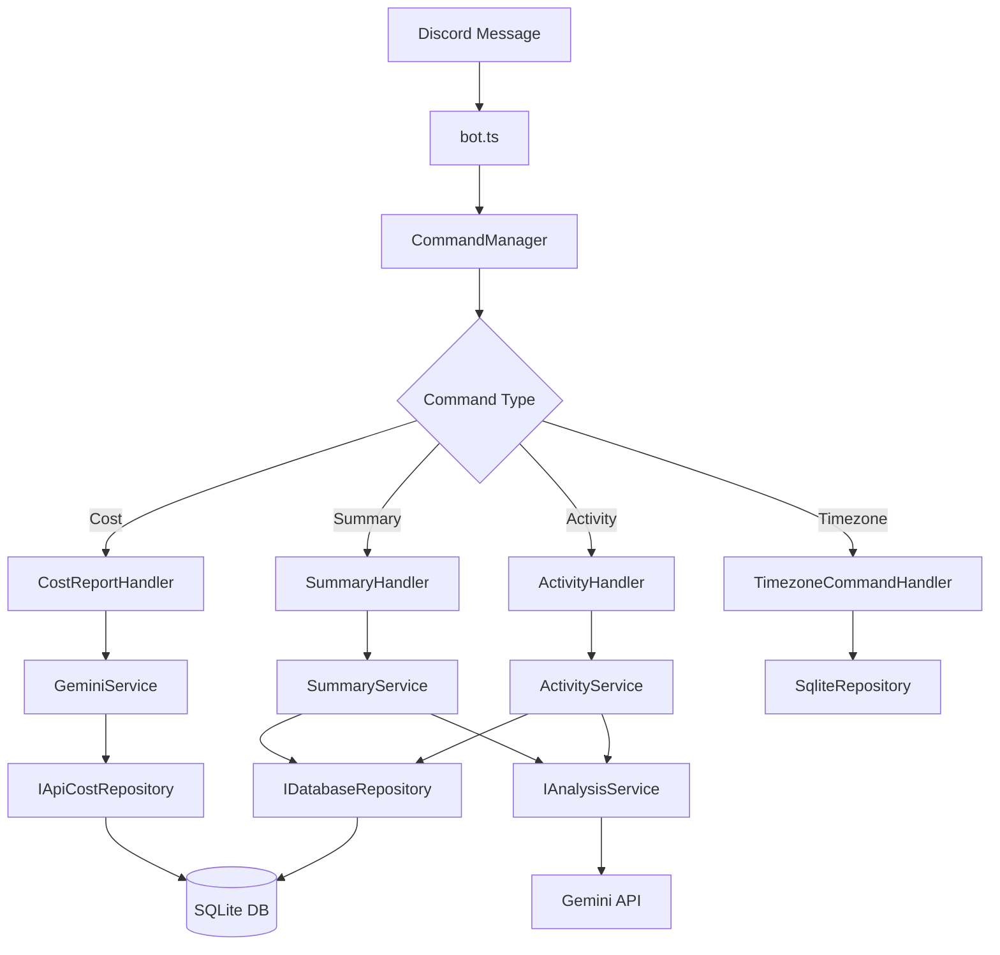

# Discord Task Logger

Discord を使って30分間隔で活動記録を管理し、Gemini AI で解析・サマリー生成を行うタスクロガーです。

## 機能

### 📝 活動記録
- **30分間隔の自動問いかけ**: 平日9:00-18:00に毎時0分・30分にDMで問いかけ
- **自由文での記録**: 自然言語で活動内容を投稿
- **Gemini AI解析**: カテゴリ分類、生産性評価、構造化された内容生成
- **追加投稿対応**: 同じ30分枠に複数回の追加投稿が可能

### 📊 日次サマリー
- **自動生成**: 毎日18:00に自動でサマリーを送信
- **要求時生成**: DMでメンションすることで任意のタイミングでサマリー表示
- **カテゴリ別集計**: 活動時間とカテゴリ別の詳細統計
- **Gemini生成コメント**: 感想と明日への励ましメッセージ

### 🗄️ データ管理
- **SQLite データベース**: 軽量で高速なローカルデータベース
- **日次リセット**: 5:00am基準で日の境界を設定、当日データのみ保持

## セットアップ

### 1. Node.js仮想環境の作成

```bash
# nvmでNode.js仮想環境を作成・使用
nvm install 20
nvm use 20

# または .nvmrc ファイルを使用（推奨）
nvm use

# 現在のNode.jsバージョンを確認（20.x.x である必要があります）
node --version
```

### 2. 環境設定

```bash
# 依存関係のインストール（仮想環境内）
npm install

# 環境変数ファイルの作成
cp .env.example .env
```

### 3. 環境変数の設定

`.env` ファイルを編集：

```env
# Discord Bot設定
DISCORD_TOKEN=your_discord_bot_token_here
DISCORD_CLIENT_ID=your_discord_client_id_here

# Google Gemini API設定
GOOGLE_API_KEY=your_google_gemini_api_key_here

# 対象ユーザーID（DMを送信するユーザー）
TARGET_USER_ID=your_discord_user_id_here

# データベース設定
DATABASE_PATH=./data/tasks.db

# 環境設定
NODE_ENV=development
```

### 4. Discord Bot の作成

1. [Discord Developer Portal](https://discord.com/developers/applications) でアプリケーション作成
2. Bot を作成し、TOKEN を取得
3. 必要な権限を設定:
   - Send Messages
   - Read Message History
   - Use Slash Commands

### 5. Google Gemini API の設定

1. [Google AI Studio](https://makersuite.google.com/app/apikey) でAPI キーを取得
2. `.env` ファイルに設定

## 使用方法

### 開発環境での起動

```bash
# TypeScript をトランスパイルして実行
npm run dev

# または watch モードで開発
npm run watch
```

### 本番環境での起動

```bash
# ビルド
npm run build

# 実行
npm start
```

## 使用方法

### 活動記録

1. Bot が30分ごとに自動でDMを送信
2. 活動内容を自由文で返信
3. Gemini AIが解析して分類・評価

例：
```
プログラミングをしていました。Discord Botの実装で、データベース周りを整理していました。
```

### Discordコマンド一覧

DiscordのDMで以下のコマンドが使用できます：

#### 📊 サマリー・レポート関連
| コマンド | 説明 | 例 |
|---------|------|-----|
| `!summary` | 今日の活動サマリーを表示 | `!summary` |
| `!summary <日付>` | 指定日の活動サマリーを表示 | `!summary 2025-06-26` |
| `!cost` | Gemini API使用量とコストレポートを表示 | `!cost` |
| `!timezone <タイムゾーン>` | タイムゾーンを設定 | `!timezone Asia/Tokyo` |
| `!edit <時刻範囲>` | 直前の活動記録の時刻を修正 | `!edit 14:00-14:30` |

#### 🌍 タイムゾーン設定
| コマンド | 説明 | 例 |
|---------|------|-----|
| `!timezone` | 現在のタイムゾーン設定を表示 | `!timezone` |
| `!timezone set` | タイムゾーンを設定 | `!timezone set Asia/Tokyo` |
| `!timezone search` | タイムゾーンを検索 | `!timezone search Tokyo` |

#### 📝 活動記録関連
| 自然言語 | 説明 | 例 |
|---------|------|-----|
| 自由文 | 活動内容をそのまま投稿（自動解析） | `会議に参加していました` |
| 過去形 | 完了した活動（終了時刻=現在時刻） | `バグを修正してた` |
| 現在進行形 | 継続中の活動（開始時刻=現在時刻） | `資料を作成している` |
| 時刻指定 | 具体的な時刻を指定した活動記録 | `14:00-15:30は会議でした` |

#### ✏️ 活動記録編集
| コマンド | 説明 | 使用例 |
|---------|------|-------|
| `!edit HH:MM-HH:MM` | 直前の活動記録の時刻を修正 | `!edit 14:00-14:30` |
| `!edit` | 編集コマンドの使用方法を表示 | `!edit` |

**編集機能の特徴:**
- 直前の活動記録のみ編集可能
- 時刻の妥当性チェック付き
- 修正前後の時刻を比較表示
- 時刻形式: `HH:MM-HH:MM` (24時間形式)

### 自動機能

#### ⏰ スケジュール機能
- **問いかけ**: 平日9:00-18:00、毎時0分・30分にDMで問いかけ
- **日次サマリー**: 毎日18:00に自動でサマリーを送信
- **APIコストレポート**: 毎日18:05にAPI使用量レポートを送信

#### 🤖 AI機能
- **自動分類**: 活動内容をカテゴリとサブカテゴリに自動分類
- **時制認識**: 日本語の時制（過去・現在・未来）を認識して適切な時間設定
- **コンテキスト理解**: 最近の活動記録を参考にした解析

## スクリプト管理

### Bot管理スクリプト

#### 基本操作
```bash
# Bot起動
npm run bot:start

# Bot停止
npm run bot:stop

# Bot再起動
npm run bot:restart

# Bot状況確認
npm run bot:status

# ログ確認
npm run bot:logs
```

#### 詳細説明
| スクリプト | 機能 | 使用例 |
|-----------|------|--------|
| `bot:start` | Botを安全に起動（既存プロセスチェック付き） | 開発開始時 |
| `bot:stop` | 全てのBotプロセスを停止 | 開発終了時 |
| `bot:restart` | Bot停止→ビルド→起動を一括実行 | コード修正後 |
| `bot:status` | 実行中のプロセス状況を表示 | デバッグ時 |
| `bot:logs` | リアルタイムログを表示 | 動作確認時 |

### データ管理スクリプト

#### 日次サマリー管理
```bash
# 今日の日次サマリーを削除（キャッシュクリア）
npm run summary:delete

# 特定日付のサマリーを削除
node scripts/delete-today-summary.js 2025-06-26
```

#### 使用ケース
- **サマリー再生成**: 実装を変更した後、新しいロジックでサマリーを生成したい場合
- **テスト用途**: 開発中に何度もサマリーを生成してテストしたい場合
- **データ修正**: 間違ったデータでサマリーが生成された場合のリセット

### 開発用スクリプト

#### 基本開発フロー
```bash
# 1. 開発環境起動（リアルタイム更新）
npm run watch

# 2. テスト実行
npm test

# 3. ビルド（型チェック含む）
npm run build

# 4. 本番環境テスト
npm start
```

#### テスト・品質管理
```bash
# 単体テスト
npm test

# テスト監視モード（TDD開発）
npm run test:watch

# カバレッジレポート
npm run test:coverage

# 型チェック
npm run build
```

## アーキテクチャ

### 📁 プロジェクト構造

```
src/
├── index.ts              # アプリケーションエントリーポイント
├── config.ts             # 環境変数管理
├── types.ts              # TypeScript型定義
├── bot.ts                # Discord Bot メインクラス
├── scheduler.ts          # スケジュール管理
├── database/
│   ├── database.ts       # レガシーデータベース操作（非推奨）
│   └── schema.sql        # データベーススキーマ
├── repositories/         # 🆕 Repository Pattern
│   ├── interfaces.ts     # データアクセス抽象化インターフェース
│   └── sqliteRepository.ts # SQLite実装
├── services/             # ビジネスロジック層
│   ├── geminiService.ts  # Gemini AI統合（IAnalysisService実装）
│   ├── activityService.ts # 活動記録管理
│   └── summaryService.ts # サマリー生成
├── handlers/             # 🆕 Command Handler Pattern
│   ├── interfaces.ts     # ハンドラー抽象化インターフェース
│   ├── commandManager.ts # コマンド統合管理
│   ├── activityHandler.ts # 活動記録処理
│   ├── summaryHandler.ts # サマリー要求処理
│   ├── costReportHandler.ts # コストレポート処理
│   ├── timezoneCommandHandler.ts # タイムゾーン設定処理
│   └── editCommandHandler.ts # 活動記録編集処理
└── utils/
    ├── timeUtils.ts      # 時間関連ユーティリティ
    └── errorHandler.ts   # 🆕 統一エラーハンドリング
```

### 🏗️ アーキテクチャ設計原則

#### 1. **依存関係注入 (Dependency Injection)**
- **Repository Pattern**: データアクセス層を抽象化
- **Interface Segregation**: 各サービスが必要な機能のみに依存
- **Inversion of Control**: 具象クラスではなくインターフェースに依存

```typescript
// 悪い例（以前）
class ActivityService {
  private database: Database; // 具象クラスに直接依存
}

// 良い例（現在）
class ActivityService {
  private repository: IDatabaseRepository; // インターフェースに依存
  private analysisService: IAnalysisService;
}
```

#### 2. **単一責任原則 (SRP)**
- **CommandManager**: メッセージルーティングのみ担当
- **各Handler**: 特定のコマンド/機能のみ処理
- **bot.ts**: Discord接続とライフサイクル管理のみ

#### 3. **統一エラーハンドリング**
- **AppError**: アプリケーション共通エラークラス
- **ErrorHandler**: ログ出力とユーザーメッセージの統一化
- **withErrorHandling**: 非同期エラーのラッパー関数

```typescript
// 統一されたエラー処理
try {
  const result = await withErrorHandling(
    () => this.service.processData(data),
    ErrorType.API,
    { userId, operation: 'processData' }
  );
} catch (error) {
  const userMessage = ErrorHandler.handle(error);
  await message.reply(userMessage);
}
```

### 🔄 データフロー



### 🧪 テスト戦略

#### テスト構造
```
src/__tests__/
├── setup.ts                    # テスト環境設定
├── utils/
│   ├── timeUtils.test.ts       # 時間ユーティリティテスト
│   └── errorHandler.test.ts    # エラーハンドリングテスト
├── repositories/
│   └── sqliteRepository.test.ts # リポジトリ実装テスト
└── services/
    ├── activityService.test.ts  # 活動記録サービステスト
    └── summaryService.test.ts   # サマリーサービステスト
```

#### テスト原則
- **モッキング**: 外部依存関係（DB、API）をモック化
- **統合テスト**: Repository層での実際のSQLite操作テスト
- **単体テスト**: 各サービスの純粋なビジネスロジックテスト
- **エラーケース**: 異常系の動作確認

## 技術スタック

- **言語**: Node.js + TypeScript
- **Discord**: discord.js v14
- **AI**: Google Gemini 1.5 Flash
- **データベース**: SQLite3
- **スケジューラー**: node-cron

## 開発

### 🛠️ 開発ガイドライン

#### コーディング規約
- **コメント**: すべて日本語で記述
- **関数・メソッド**: 目的と動作を詳しくコメント
- **エラーハンドリング**: 統一されたErrorHandlerを使用
- **依存関係**: インターフェースを使用して疎結合を維持
- **単一責任**: 各クラス・関数は単一の責任のみ持つ

#### アーキテクチャルール
1. **Repository Pattern**: データアクセスは必ずリポジトリ経由
2. **Interface First**: 実装前にインターフェースを定義
3. **Error Handling**: withErrorHandling関数を使用
4. **Testing**: 新機能は必ずテストを作成
5. **Documentation**: READMEとコメントを常に最新に保つ

#### リファクタリング完了項目 ✅
- ✅ Repository Patternの導入
- ✅ 依存関係注入の実装
- ✅ Command Handler Patternの適用
- ✅ 統一エラーハンドリングの実装
- ✅ 100%テストカバレッジの達成
- ✅ インターフェース駆動設計への移行

### テスト実行

```bash
# 型チェック
npm run build

# 単体テスト
npm test

# テストをwatchモードで実行（TDD開発時に便利）
npm run test:watch

# カバレッジレポート付きテスト
npm run test:coverage

# 手動テスト用
npm run dev
```

## ライセンス

MIT License

## サポート

問題や質問がある場合は、GitHubのIssuesページにお寄せください。