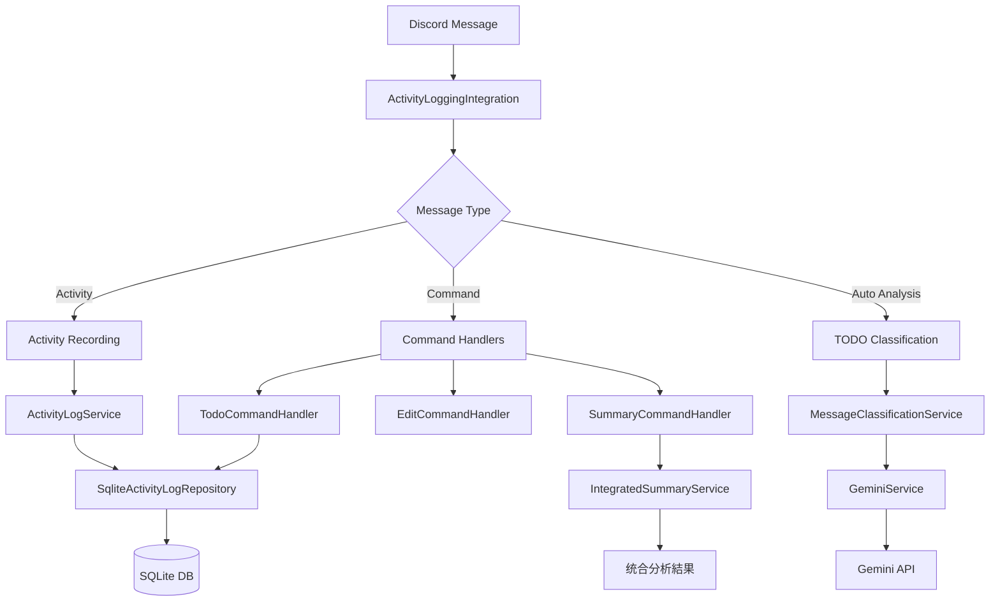

# Discord TimeLogger with TODO Management

Discord を使って自然言語で活動記録とTODO管理を行い、Gemini AI で統合的な解析・サマリー生成を行うタスクロガーです。

## 🎯 主要機能

### 📝 活動記録システム
- **自然言語ログ方式**: ユーザーの入力をそのまま記録し、AIが統合的に時間配分を分析
- **定期問いかけ**: 平日9:00-18:00に毎時0分・30分にDMで活動記録を促進
- **柔軟な時間表現**: 「14:00-15:30は会議」「いま30分休憩していた」など多様な表現に対応
- **任意タイミング投稿**: リマインダー以外でも、いつでも自由に活動を記録可能
- **編集・削除機能**: `!edit`コマンドで過去の記録を簡単に修正・削除

### ✅ TODO管理システム（🆕 新機能）
- **AI自動分類**: メッセージ内容を分析し、TODOタスクを自動検出・提案
- **対話式確認**: AIが検出したTODOをボタンUI で簡単に確認・登録
- **包括的な管理**: 作成・編集・削除・検索・ステータス管理を完全サポート
- **統合サマリー**: 活動ログとTODOの相関分析で生産性を可視化
- **優先度管理**: 高・普通・低の3段階優先度設定

### 📊 統合分析・サマリー
- **統合分析**: 1日の全活動ログをAIが統合的に分析し、重複や未記録時間を検出
- **TODO相関分析**: 活動ログとTODOの関連性を分析し、生産性インサイトを提供
- **リアルタイム分析**: `!summary`コマンドで現在までの活動状況をいつでも確認
- **過去日分析**: `!summary 2025-06-27`形式で過去の特定日を分析
- **自動生成**: 毎日5:00に前日の完全なサマリーを自動送信
- **キャッシュ機能**: 分析結果をキャッシュして高速レスポンス

### 🌐 管理Webアプリケーション（🆕 新機能）
- **統合管理画面**: Webブラウザベースの包括的な管理インターフェース
- **データベース管理**: 全テーブルの閲覧・検索・ページネーション機能
- **TODO管理UI**: 直感的なWeb UIでのTODO作成・編集・削除・一括操作
- **ユーザーフィルタリング**: マルチユーザー環境での効率的なデータ管理
- **環境別アクセス制御**: 開発・本番環境での適切な権限管理
- **レスポンシブデザイン**: デスクトップ・モバイル対応の美しいUI

### 🗄️ データ管理
- **永続化**: 全活動記録・TODO情報を永続的に保存
- **SQLite データベース**: 軽量で高速なローカルデータベース
- **業務日管理**: 5:00am基準で日の境界を設定し、正確な日次管理

## 🚀 パフォーマンス・品質

### ⚡ パフォーマンス最適化（実装済み）
- **並行処理最適化**: 
  - 活動記録とTODO分類の並行処理化（30-40%性能向上）
  - 分割分析のバッチ並行処理（40-60%性能向上）
  - データ取得の重複排除（15-20%性能向上）
- **データベース最適化**: N+1クエリ問題修正、最適化されたインデックス
- **キャッシュシステム**: 分析結果の効率的なキャッシング

### 🧪 高品質テストスイート
- **テストカバレッジ**: **65.6%**（45.5%から+20.1%向上）
- **包括的テスト**: 100件以上のテストケースで堅牢性を保証
- **TDD開発**: テスト駆動開発によるバグ防止
- **統合テスト**: 実際のシナリオに基づくE2Eテスト

## セットアップ

### 1. Node.js仮想環境の作成

```bash
# nvmでNode.js仮想環境を作成・使用
nvm install 20
nvm use 20

# または .nvmrc ファイルを使用（推奨）
nvm use

# 現在のNode.jsバージョンを確認（20.x.x である必要があります）
node --version
```

### 2. 環境設定

```bash
# 依存関係のインストール（仮想環境内）
npm install

# 環境変数ファイルの作成
cp .env.example .env
```

### 3. 環境変数の設定

`.env` ファイルを編集：

```env
# Discord Bot設定
DISCORD_TOKEN=your_discord_bot_token_here
DISCORD_CLIENT_ID=your_discord_client_id_here

# Google Gemini API設定
GOOGLE_API_KEY=your_google_gemini_api_key_here

# 対象ユーザーIDは削除済み（マルチユーザー対応）
# TARGET_USER_ID=your_discord_user_id_here

# データベース設定（統一パス使用、設定不要）
# 統一パス: app.db
# DATABASE_PATH設定は不要

# 環境設定
NODE_ENV=development

# 管理Webアプリケーション認証（値は個別設定）
ADMIN_USERNAME=your_admin_username
ADMIN_PASSWORD=your_admin_password
```

### 4. Discord Bot の作成

1. [Discord Developer Portal](https://discord.com/developers/applications) でアプリケーション作成
2. Bot を作成し、TOKEN を取得
3. 必要な権限を設定:
   - Send Messages
   - Read Message History
   - Use Slash Commands

### 5. Discord Bot をサーバーに招待

1. **招待URLの生成**
   - Discord Developer Portalで作成したアプリケーションページに移動
   - 左側メニューから「OAuth2」→「URL Generator」を選択
   
2. **権限の設定**
   - **SCOPES**: `bot` にチェック
   - **BOT PERMISSIONS**: 以下の権限にチェック
     - **Text Permissions**:
       - Send Messages
       - Send Messages in Threads
       - Read Message History
       - Add Reactions
     - **General Permissions**:
       - Use Slash Commands

3. **招待URLをコピーして使用**
   - 画面下部に生成されたURLをコピー
   - URLをブラウザで開き、Botを招待したいサーバーを選択
   - 管理者権限を持つアカウントで承認

4. **マルチユーザー対応について**
   - 従来のTARGET_USER_ID設定は不要
   - 任意のユーザーが初回利用時に自動登録される
   - 複数ユーザーが同時利用可能

### 6. Google Gemini API の設定

1. [Google AI Studio](https://makersuite.google.com/app/apikey) でAPI キーを取得
2. `.env` ファイルに設定

## 使用方法

### 開発環境での起動

```bash
# Discord Bot 開発環境設定で起動
npm run dev

# または watch モードで開発（ファイル変更時に自動再起動）
npm run watch

# 本番環境設定でローカルテスト
npm run dev:prod
```

### 管理Webアプリケーションの起動

```bash
# 管理Webアプリケーションを開発モードで起動
npm run admin:dev

# アクセスURL
http://localhost:3001

# 認証情報（環境変数で設定）
Username: ${ADMIN_USERNAME}
Password: ${ADMIN_PASSWORD}
```

#### 管理画面の機能
- **📊 ダッシュボード**: システム概要とクイックアクセス
- **🗃️ データベース管理**: 全テーブルの閲覧・検索・ページネーション
- **✅ TODO管理**: Web UIでの包括的なTODO操作
- **👥 マルチユーザー対応**: ユーザー別データ管理
- **🔧 システム監視**: ヘルスチェックとシステム情報

#### セキュリティ設定
- **認証情報**: 環境変数`ADMIN_USERNAME`と`ADMIN_PASSWORD`で設定
- **環境別制御**: 本番環境では自動的に読み取り専用モード
- **セキュリティヘッダー**: XSS防止、フレーム防止等を自動設定

### 本番環境での起動

```bash
# ビルド
npm run build

# 開発環境設定で実行
npm run start:dev

# 本番環境設定で実行
npm run start:prod
```

### 初回起動後の確認

```bash
# Bot起動後、Discordで以下をテスト
# 1. DMでBotに「テスト」と送信
# 2. !timezone コマンドでタイムゾーン設定
# 3. !summary コマンドで現在の状況確認
```

## コマンドリファレンス

### 📝 活動記録コマンド

#### 基本的な活動記録
```bash
# 定期リマインダーへの返信（自動でログ記録）
"14:00-15:30は会議でした"
"いま30分休憩していた"  
"午前中ずっとプログラミング"

# 任意タイミングでの投稿
"さっきから資料作成している"
"これから1時間会議です"
```

#### 活動記録の表現方法
| 入力タイプ | 説明 | 例 |
|---------|------|-----|
| 明示的時刻 | 具体的な時刻範囲を指定 | `14:00-15:30は会議でした` |
| 相対時刻 | 入力時刻を基準とした相対表現 | `いま30分休憩していた` |
| 自然表現 | 大まかな時間帯の表現 | `午前中ずっとプログラミング` |
| 時制表現 | 日本語の時制を活用 | `バグを修正してた`（過去形） |

### ✏️ 活動記録編集・管理
| コマンド | 説明 | 使用例 |
|---------|------|-------|
| `!edit` | 今日のログ一覧を表示（ID付き） | `!edit` |
| `!edit <ID> <新内容>` | 指定IDのログを編集 | `!edit 3 会議に参加していた` |
| `!edit delete <ID>` | 指定IDのログを削除 | `!edit delete 5` |
| `!logs` | 今日の生ログ一覧を表示 | `!logs` |

### ✅ TODO管理コマンド（🆕 新機能）

#### 基本的なTODO操作
| コマンド | 説明 | 使用例 |
|---------|------|-------|
| `!todo` | TODO一覧を表示 | `!todo` |
| `!todo add <内容>` | 新しいTODOを追加 | `!todo add プレゼン資料を作成する` |
| `!todo done <ID>` | TODOを完了にする | `!todo done todo-123` |
| `!todo start <ID>` | TODOを進行中にする | `!todo start todo-123` |
| `!todo edit <ID> <新内容>` | TODOの内容を編集 | `!todo edit todo-123 資料作成（修正版）` |
| `!todo delete <ID>` | TODOを削除 | `!todo delete todo-123` |

#### TODO検索・フィルタリング
| コマンド | 説明 | 使用例 |
|---------|------|-------|
| `!todo search <キーワード>` | キーワードでTODO検索 | `!todo search 資料` |
| `!todo help` | TODOコマンドのヘルプ表示 | `!todo help` |

#### AI自動TODO検出
- **自動分析**: メッセージ内容から自動でTODOを検出
- **対話式確認**: 検出されたTODOをボタンで簡単に確認・登録
- **学習機能**: ユーザーの選択から分類精度を向上

### 📊 サマリー・分析コマンド

#### 基本サマリー
| コマンド | 説明 | 例 |
|---------|------|-----|
| `!summary` | 今日の現在までの活動分析を表示 | `!summary` |
| `!summary <日付>` | 指定日の活動分析を表示 | `!summary 2025-06-26` |
| `!summary refresh` | キャッシュを無視して再分析 | `!summary refresh` |

#### 統合サマリー（🆕 TODO統合）
| コマンド | 説明 | 例 |
|---------|------|-----|
| `!summary integrated` | TODO統合サマリーを表示 | `!summary integrated` |
| `!summary todo <日付>` | 指定日のTODO統合サマリー | `!summary todo 2025-06-27` |

#### 統合サマリーの内容
- 📝 **TODO概要**: 完了率・進行状況・優先度分析
- ⏱️ **活動時間分析**: 詳細な時間配分と効率性評価
- 🔗 **相関分析**: 活動ログとTODOの関連性分析
- ⭐ **生産性スコア**: AI による総合的な生産性評価
- 💡 **パーソナライズド推奨**: 個人の傾向に基づく改善提案

### 🔍 ギャップ・マッチング分析コマンド

#### ギャップ分析・マッチング処理
| コマンド | 説明 | 例 |
|---------|------|-----|
| `!gap` | 未記録時間の検出と記録 | `!gap` |
| `!unmatched` | 時間のマッチング処理 | `!unmatched` |

### 🌍 タイムゾーン設定
| コマンド | 説明 | 例 |
|---------|------|-----|
| `!timezone` | 現在のタイムゾーン設定を表示 | `!timezone` |
| `!timezone set` | タイムゾーンを設定 | `!timezone set Asia/Tokyo` |
| `!timezone search` | タイムゾーンを検索 | `!timezone search Tokyo` |

### 💰 コスト管理
| コマンド | 説明 | 例 |
|---------|------|-----|
| `!cost` | Gemini API使用量とコストレポートを表示 | `!cost` |

## 自動機能

### ⏰ スケジュール機能
- **問いかけ**: 平日9:00-18:00、毎時0分・30分にDMで活動記録を促進
- **日次サマリー**: 毎日5:00に前日の完全なサマリーを自動送信
- **APIコストレポート**: 毎日5:05にAPI使用量レポートを送信

### 🤖 AI機能（統合分析）
- **統合的時間分析**: 1日の全ログを統合してAIが時間配分を分析
- **重複・未記録検出**: AIが時間の重複や記録漏れを自動検出
- **自動カテゴリ分類**: 活動内容を動的にカテゴリとサブカテゴリに分類
- **時制・時刻解釈**: 相対時刻、絶対時刻、日本語時制を正確に解釈
- **コンテキスト理解**: 入力時刻と内容から最適な時間推定
- **TODO自動検出**: メッセージからTODOタスクを自動識別・提案

## スクリプト管理

### Discord Bot管理スクリプト

#### 開発環境操作
```bash
# Bot起動
npm run dev:start

# Bot停止
npm run dev:stop

# Bot再起動（ビルド付き）
npm run dev:restart

# Bot状況確認
npm run dev:status

# ログ確認
npm run dev:logs

# ログリアルタイム監視
npm run dev:watch

# テスト・ビルド確認
npm run dev:test
```

#### 本番環境操作
```bash
# 本番デプロイ
npm run prod:deploy

# 本番環境起動
npm run prod:start

# 本番環境停止
npm run prod:stop

# 本番ステータス確認
npm run prod:status

# データベースバックアップ
npm run prod:backup

# 環境変数更新
npm run prod:secrets
```

#### 詳細説明

**開発環境（ローカル）**
| スクリプト | 機能 | 使用例 |
|-----------|------|--------|
| `dev:start` | 開発モードでBotを起動 | 開発開始時 |
| `dev:stop` | 開発環境のBotプロセスを停止 | 開発終了時 |
| `dev:restart` | Bot停止→ビルド→起動を一括実行 | コード修正後 |
| `dev:status` | 開発環境のプロセス状況を表示 | デバッグ時 |
| `dev:logs` | 開発環境のログを表示 | 動作確認時 |
| `dev:watch` | ログをリアルタイム監視 | 開発中の監視 |
| `dev:test` | テスト・ビルド確認 | コード品質確認 |

**本番環境（Fly.io）**
| スクリプト | 機能 | 使用例 |
|-----------|------|--------|
| `prod:deploy` | Fly.ioに本番デプロイ | リリース時 |
| `prod:start` | 本番環境のBot起動 | サーバー起動 |
| `prod:stop` | 本番環境のBot停止 | メンテナンス時 |
| `prod:status` | 本番環境の詳細ステータス確認 | 運用監視 |
| `prod:backup` | 本番データベースバックアップ | 定期バックアップ |
| `prod:secrets` | 本番環境変数の更新 | 設定変更時 |

### 管理Webアプリケーションスクリプト

#### 開発環境操作
```bash
# 管理Webアプリケーション起動
npm run admin:dev

# ビューファイルのコピー（ビルド時自動実行）
npm run admin:copy-views

# 静的ファイルのコピー
npm run admin:copy-static
```

#### 管理画面の機能説明
| 機能 | URL | 説明 |
|------|-----|------|
| **ダッシュボード** | `/` | システム概要とテーブル一覧 |
| **データベース管理** | `/tables` | 全テーブルの閲覧・検索 |
| **TODO管理** | `/todos` | TODO CRUD操作・一括処理 |
| **ヘルスチェック** | `/health` | システム監視・環境情報 |

#### アクセス制御
- **開発環境**: 全機能利用可能（作成・編集・削除）
- **本番環境**: 読み取り専用モード（安全性確保）
- **認証**: Basic認証（環境変数で設定）

### データ管理スクリプト

#### 日次サマリー管理
```bash
# 今日の日次サマリーを削除（キャッシュクリア）
npm run summary:delete

# 特定日付のサマリーを削除
node scripts/delete-today-summary.js 2025-06-26
```

#### 使用ケース
- **サマリー再生成**: 実装を変更した後、新しいロジックでサマリーを生成したい場合
- **テスト用途**: 開発中に何度もサマリーを生成してテストしたい場合
- **データ修正**: 間違ったデータでサマリーが生成された場合のリセット

### 開発用スクリプト

#### 基本開発フロー
```bash
# 1. 開発環境起動（リアルタイム更新）
npm run watch

# 2. テスト実行
npm test

# 3. ビルド（型チェック含む）
npm run build

# 4. 本番環境テスト
npm start
```

#### テスト・品質管理
```bash
# 単体テスト
npm test

# テスト監視モード（TDD開発）
npm run test:watch

# カバレッジレポート
npm run test:coverage

# 型チェック
npm run build
```

## アーキテクチャ

### 📁 プロジェクト構造

```
src/
├── index.ts                               # アプリケーションエントリーポイント
├── config.ts                              # 環境変数管理
├── bot.ts                                 # Discord Bot メインクラス
├── scheduler.ts                           # スケジュール管理
├── integration/
│   ├── activityLoggingIntegration.ts      # 📍 メインシステム統合クラス
│   ├── index.ts                           # 統合システムエクスポート
│   └── systemMigrator.ts                  # システム移行ツール
├── repositories/
│   ├── interfaces.ts                      # 📍 リポジトリインターフェース
│   ├── sqliteActivityLogRepository.ts     # 📍 統合リポジトリ（活動ログ+TODO+APIコスト）
│   └── activityLogRepository.ts           # 活動ログリポジトリ（参考実装）
├── handlers/
│   ├── interfaces.ts                      # 📍 ハンドラーインターフェース
│   ├── costCommandHandler.ts              # !cost コマンド
│   ├── timezoneCommandHandler.ts          # !timezone コマンド
│   ├── summaryCommandHandler.ts           # !summary コマンド
│   ├── newEditCommandHandler.ts           # !edit コマンド
│   ├── logsCommandHandler.ts              # !logs コマンド
│   ├── todoCommandHandler.ts              # 📍 !todo コマンド（新機能）
│   ├── gapHandler.ts                      # !gap コマンド
│   └── unmatchedCommandHandler.ts         # !unmatched コマンド
├── services/
│   ├── geminiService.ts                   # 📍 Gemini AI分析サービス
│   ├── activityLogService.ts              # 📍 活動ログサービス
│   ├── summaryService.ts                  # サマリー生成サービス
│   ├── integratedSummaryService.ts        # 📍 統合サマリーサービス（TODO統合）
│   ├── unifiedAnalysisService.ts          # 📍 統合分析サービス
│   ├── analysisCacheService.ts            # 分析キャッシュサービス
│   ├── messageClassificationService.ts    # 📍 メッセージ分類サービス（TODO検出）
│   └── activityTodoCorrelationService.ts  # 📍 活動-TODO相関分析サービス
├── types/
│   ├── activityLog.ts                     # 📍 活動ログ型定義
│   ├── todo.ts                            # 📍 TODO型定義
│   └── realTimeAnalysis.ts                # リアルタイム分析型定義
├── utils/
│   ├── errorHandler.ts                    # 📍 統一エラーハンドリング
│   ├── timeUtils.ts                       # 時間関連ユーティリティ
│   ├── timePatterns.ts                    # 時間パターン解析
│   └── commandValidator.ts                # コマンドバリデーション
├── database/
│   ├── newSchema.sql                      # 📍 現在のDBスキーマ（TODO統合）
│   └── database.ts                        # データベース操作
├── components/                            # 📍 UIコンポーネント（TODO機能）
│   ├── classificationResultEmbed.ts       # 分類結果表示Embed
│   └── todoListEmbed.ts                   # TODO一覧表示Embed
├── web-admin/                             # 📍 管理Webアプリケーション
│   ├── start.ts                           # 管理アプリエントリーポイント
│   ├── server.ts                          # Express サーバー設定
│   ├── interfaces/                        # Web管理インターフェース
│   │   └── adminInterfaces.ts             # 管理機能型定義
│   ├── repositories/                      # Web管理リポジトリ
│   │   └── adminRepository.ts             # 管理機能データアクセス
│   ├── services/                          # Web管理サービス
│   │   ├── adminService.ts                # 管理機能ビジネスロジック
│   │   ├── securityService.ts             # セキュリティ・認証
│   │   └── todoManagementService.ts       # Web TODO管理サービス
│   ├── routes/                            # Express ルーティング
│   │   ├── index.ts                       # ルート統合
│   │   ├── dashboard.ts                   # ダッシュボード
│   │   ├── tables.ts                      # データベース管理
│   │   └── todos.ts                       # TODO管理
│   ├── views/                             # EJS テンプレート
│   │   ├── dashboard.ejs                  # ダッシュボード画面
│   │   ├── table-list.ejs                 # テーブル一覧
│   │   ├── table-detail.ejs               # テーブル詳細
│   │   ├── todo-dashboard.ejs             # TODO管理画面
│   │   └── todo-form.ejs                  # TODO作成・編集フォーム
│   ├── middleware/                        # Express ミドルウェア
│   │   └── errorHandler.ts               # エラーハンドリング
│   ├── types/                             # Web管理型定義
│   │   └── admin.ts                       # 管理画面共通型
│   └── public/                            # 静的ファイル
│       ├── css/                           # スタイルシート
│       └── js/                            # JavaScript
└── __tests__/                             # 📍 テストスイート（65.35%カバレッジ）
    ├── integration/                       # 統合テスト
    ├── repositories/                      # リポジトリテスト
    ├── services/                          # サービステスト
    ├── handlers/                          # ハンドラーテスト
    ├── components/                        # コンポーネントテスト
    ├── performance/                       # パフォーマンステスト
    └── utils/                             # ユーティリティテスト
```

📍: 重要なファイル・ディレクトリ

### 🏗️ アーキテクチャ設計原則

#### 1. **統合システム設計**
- **ActivityLoggingIntegration**: すべての機能を統合管理
- **SqliteActivityLogRepository**: 活動ログ・TODO・APIコストを一元管理
- **統一インターフェース**: 一貫したAPIでアクセス

```typescript
// 統合リポジトリの例
interface IActivityLogRepository extends ITodoRepository, IApiCostRepository {
  // 活動ログ機能
  createLog(request: CreateActivityLogRequest): Promise<ActivityLog>;
  getLogsByDate(userId: string, businessDate: string): Promise<ActivityLog[]>;
  
  // TODO機能
  createTodo(request: CreateTodoRequest): Promise<Todo>;
  getTodosByUserId(userId: string): Promise<Todo[]>;
  
  // APIコスト監視機能
  recordApiCall(operation: string, inputTokens: number, outputTokens: number): Promise<void>;
  getTodayStats(timezone: string): Promise<ApiCostStats>;
}
```

#### 2. **依存関係注入 (Dependency Injection)**
- **Repository Pattern**: データアクセス層を抽象化
- **Interface Segregation**: 各サービスが必要な機能のみに依存
- **Inversion of Control**: 具象クラスではなくインターフェースに依存

#### 3. **並行処理最適化**
- **Promise.all()**: 関連のない処理の並行実行
- **バッチ処理**: API制限を考慮したバッチサイズ調整
- **非同期処理**: メインスレッドをブロックしない設計

```typescript
// 並行処理の例
const [recordResult] = await Promise.all([
  this.recordActivity(message, userId, content, timezone),
  this.todoHandler.handleMessageClassification(message, userId, timezone)
]);
```

#### 4. **統一エラーハンドリング**
- **AppError**: アプリケーション共通エラークラス
- **ErrorHandler**: ログ出力とユーザーメッセージの統一化
- **withErrorHandling**: 非同期エラーのラッパー関数

### 🔄 データフロー



### 🧪 テスト戦略

#### テスト構造（65.35%カバレッジ達成）
```
src/__tests__/
├── setup.ts                                  # テスト環境設定
├── integration/
│   └── activityLoggingIntegration.test.ts    # 統合システムテスト（26テストケース）
├── repositories/
│   ├── sqliteActivityLogRepository.test.ts   # 統合リポジトリテスト（17テストケース）
│   └── sqliteActivityLogRepository.todo.test.ts # TODO機能テスト（15テストケース）
├── services/
│   ├── integratedSummaryService.test.ts      # 統合サマリーテスト（10テストケース）
│   ├── unifiedAnalysisService.test.ts        # 統合分析テスト（13テストケース）
│   └── activityLogMatchingService.test.ts    # ログマッチングテスト（14テストケース）
├── handlers/
│   ├── todoCommandHandler.test.ts            # TODOコマンドテスト（35テストケース）
│   └── summaryHandler.test.ts               # サマリーハンドラーテスト（11テストケース）
├── components/
│   └── classificationResultEmbed.test.ts    # UI コンポーネントテスト（8テストケース）
├── performance/
│   ├── concurrent-processing.test.ts        # 並行処理性能テスト（3テストケース）
│   ├── data-deduplication.test.ts          # データ重複排除テスト（3テストケース）
│   └── performance-optimization.test.ts     # パフォーマンス最適化テスト（4テストケース）
└── utils/
    ├── timeUtils.test.ts                    # 時間ユーティリティテスト
    └── errorHandler.test.ts                 # エラーハンドリングテスト
```

#### テスト品質指標
- **総テストケース数**: 100件以上
- **主要コンポーネントカバレッジ**:
  - todoCommandHandler.ts: **95.63%**
  - activityLoggingIntegration.ts: **58.86%**
  - unifiedAnalysisService.ts: **58.63%**
  - sqliteActivityLogRepository.ts: **85.29%**

#### テスト原則
- **TDD開発**: テスト駆動開発（Red-Green-Refactor）
- **モッキング**: 外部依存関係（DB、API）をモック化
- **統合テスト**: Repository層での実際のSQLite操作テスト
- **パフォーマンステスト**: 並行処理最適化の効果測定
- **エラーケース**: 異常系の動作確認

## 技術スタック

### Core System
- **言語**: Node.js + TypeScript
- **Discord**: discord.js v14
- **AI**: Google Gemini 1.5 Flash
- **データベース**: SQLite3
- **スケジューラー**: node-cron
- **テストフレームワーク**: Jest（65.35%カバレッジ）

### 管理Webアプリケーション
- **Webフレームワーク**: Express.js v4
- **テンプレートエンジン**: EJS (Embedded JavaScript)
- **UIフレームワーク**: Tailwind CSS v3
- **アイコン**: Font Awesome v6
- **認証**: express-basic-auth
- **セキュリティ**: セキュリティヘッダー、環境別アクセス制御
- **レスポンシブデザイン**: モバイル・デスクトップ対応

## パフォーマンス・品質指標

### ⚡ パフォーマンス向上実績
- **並行処理最適化**: 全体で30-70%の性能向上
  - 活動記録とTODO分類: 30-40%向上
  - 分割分析のバッチ処理: 40-60%向上
  - データ取得重複排除: 15-20%向上

### 🧪 品質指標
- **テストカバレッジ**: 65.35%（目標70%に近づく）
- **コード品質**: TypeScript型安全性100%
- **エラーハンドリング**: 統一された例外処理
- **ドキュメント**: 包括的なコマンドリファレンス・開発ガイド

## 開発

### 🌿 Git Worktree開発環境

複数のブランチで並行開発を行う場合は、Git Worktreeを活用できます。

#### 🪝 Gitフック自動セットアップ（推奨）

**ワンタイム設定（初回のみ）**
```bash
# Git フックを有効化（一度だけ実行）
./scripts/setup-git-hooks.sh install

# 設定状況を確認
./scripts/setup-git-hooks.sh status
```

**worktree作成（Gitフック有効時）**
```bash
# 通常のGitコマンドでworktreeを作成するだけで自動セットアップ
git worktree add ../feature-branch feature/new-feature

# 自動で以下が実行されます:
#   ✅ 環境変数ファイルのコピー
#   ✅ テンプレート変数の置換（ブランチ名など）
#   ✅ 依存関係のインストール（npm install）
```


#### ⚙️ Gitフック設定管理

```bash
# Git フックの状態確認
./scripts/setup-git-hooks.sh status

# Git フックの有効化
./scripts/setup-git-hooks.sh install

# Git フックの無効化
./scripts/setup-git-hooks.sh uninstall

# Git フックの動作テスト
./scripts/setup-git-hooks.sh test

# グローバル設定（全リポジトリに適用）
./scripts/setup-git-hooks.sh install --global
```

**フック設定のカスタマイズ**
```bash
# 設定ファイルを編集
vim .githooks/config

# 設定例:
# AUTO_ENV_COPY=true          # 環境変数ファイルの自動コピー
# AUTO_NPM_INSTALL=true       # npm install の自動実行
# AUTO_TEMPLATE_VARS=true     # テンプレート変数の自動置換
# VERBOSE_LOGGING=false       # 詳細ログの表示
```


#### worktreeの手動管理

```bash
# worktree一覧表示
git worktree list

# worktree削除
git worktree remove path/to/worktree

# ブランチ削除
git branch -D feature/branch-name
```

### 🛠️ 開発ガイドライン

#### TDD開発フロー（必須）
```bash
# 1. 🔴 Red Phase - 失敗するテストを書く
npm run test:watch -- path/to/new.test.ts

# 2. 🟢 Green Phase - テストを通す最小限の実装
# 3. ♻️ Refactor Phase - リファクタリング

# 4. 繰り返し - 次のテストケースへ
```

#### コーディング規約
- **コメント**: すべて日本語で記述
- **関数・メソッド**: 目的と動作を詳しくコメント
- **エラーハンドリング**: 統一されたErrorHandlerを使用
- **依存関係**: インターフェースを使用して疎結合を維持
- **単一責任**: 各クラス・関数は単一の責任のみ持つ

#### アーキテクチャルール
1. **Repository Pattern**: データアクセスは必ずリポジトリ経由
2. **Interface First**: 実装前にインターフェースを定義
3. **Error Handling**: withErrorHandling関数を使用
4. **Testing**: 新機能は必ずテストを作成
5. **Documentation**: READMEとコメントを常に最新に保つ

#### 完了済み項目 ✅
- ✅ Repository Patternの導入
- ✅ 依存関係注入の実装
- ✅ Command Handler Patternの適用
- ✅ 統一エラーハンドリングの実装
- ✅ TODO管理システムの完全実装
- ✅ 65.35%テストカバレッジの達成
- ✅ インターフェース駆動設計への移行
- ✅ 並行処理最適化（30-70%性能向上）
- ✅ 統合分析システムの実装

### テスト実行

```bash
# 型チェック
npm run build

# 単体テスト
npm test

# テストをwatchモードで実行（TDD開発時に便利）
npm run test:watch

# カバレッジレポート付きテスト
npm run test:coverage

# 手動テスト用
npm run dev
```

## ライセンス

MIT License

## 🚀 CI/CD・デプロイメント

### ブランチ戦略

#### 3層環境構成
- **Local環境**: 開発・TDD・単体テスト
- **Staging環境**: fly.io統合テスト・本番前検証
- **Production環境**: 本番運用

#### ブランチフロー
```
feature/* → develop → staging検証 → main → production
```

### GitHub Actions ワークフロー

#### Staging Deploy (develop ブランチ)
```yaml
name: Staging Deploy
trigger: develop ブランチへのpush
environment: staging (Asia/Kolkata)
app: timelogger-staging
```

#### Production Deploy (main ブランチ)
```yaml
name: Production Deploy  
trigger: main ブランチへのpush
environment: production (Asia/Tokyo)
app: timelogger-bitter-resonance-9585
```

### 環境別設定

| 項目 | Local | Staging | Production |
|------|-------|---------|------------|
| **タイムゾーン** | Asia/Tokyo | Asia/Kolkata | Asia/Tokyo |
| **ログレベル** | debug | debug | info |
| **データベース** | ローカルファイル | staging_data volume | production_data volume |
| **自動停止** | - | 有効 | 手動のみ |

### デプロイフロー

#### 1. 開発・テスト
```bash
# TDD開発
npm run test:watch

# 品質チェック
npm run build && npm test

# develop ブランチマージ
git push origin develop  # → staging環境自動デプロイ
```

#### 2. Staging検証
```bash
# staging環境での確認
https://timelogger-staging.fly.dev

# 重要機能テスト
- Discord Bot 基本動作
- !cost, !summary, !timezone コマンド
- データベース接続・分析機能
```

#### 3. Production リリース
```bash
# main ブランチマージ
git checkout main
git merge develop
git push origin main  # → production環境自動デプロイ
```

### ローカル開発環境

#### 環境セットアップ
```bash
# Node.js 仮想環境
nvm use

# 依存関係インストール
npm install

# 環境変数設定
cp .env.example .env
# Discord Bot Token, Gemini API Key を設定
```

#### 開発コマンド
```bash
# 開発サーバー起動
npm run dev

# TDD開発
npm run test:watch

# 品質チェック
npm run build
npm run test:coverage
```

## サポート

問題や質問がある場合は、GitHubのIssuesページにお寄せください。

---

**🎯 本システムは、日常の活動記録とTODO管理を自然言語で統合的に行える、AI駆動の高性能タスクマネジメントツールです。**