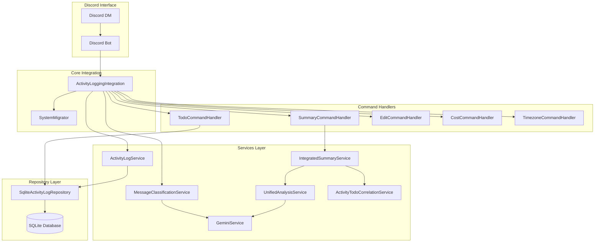

# 開発者ガイド

Discord TimeLogger with TODO Management の開発者向け包括的ガイドです。

## 🛠️ 開発環境セットアップ

### 前提条件
- Node.js 20.x (nvmを使用した仮想環境推奨)
- Git
- Discord Developer Account
- Google AI Studio Account (Gemini API)

### 初回セットアップ
```bash
# 1. リポジトリクローン
git clone <repository-url>
cd TimeLogger-todo

# 2. Node.js仮想環境設定
nvm use  # .nvmrcファイルに基づいてNode.js 20を使用

# 3. 依存関係インストール
npm install

# 4. 環境変数設定
cp .env.example .env
# .envファイルを編集（API keys等を設定）

# 5. データベース初期化（初回起動時に自動実行）
npm run build

# 6. テスト実行（環境確認）
npm test
```

### 開発ツール
```bash
# TypeScript監視モード（推奨）
npm run watch

# 個別ビルド・実行
npm run build
npm run dev

# テスト関連
npm run test:watch    # TDD開発用
npm run test:coverage # カバレッジ確認
```

---

## 🏗️ アーキテクチャ理解

### システム全体像



### レイヤー別責任

#### 1. Integration Layer（統合層）
- **ActivityLoggingIntegration**: システム全体の統合管理
- **役割**: メッセージルーティング、ライフサイクル管理、エラー統制

#### 2. Handler Layer（ハンドラー層）
- **各CommandHandler**: 特定コマンドの処理
- **役割**: コマンド解析、バリデーション、レスポンス生成

#### 3. Service Layer（サービス層）
- **ビジネスロジック**: 機能実装の中核
- **役割**: AI分析、データ処理、外部API連携

#### 4. Repository Layer（リポジトリ層）
- **SqliteActivityLogRepository**: 統合データアクセス
- **役割**: データ永続化、トランザクション管理

---

## 🔧 TDD開発フロー（必須）

### t_wada式TDDサイクル

#### 🔴 Red Phase - 失敗するテストを書く
```bash
# 1. 新機能のテストファイル作成
touch src/__tests__/services/newFeature.test.ts

# 2. テスト監視モード開始
npm run test:watch -- src/__tests__/services/newFeature.test.ts

# 3. 失敗するテストを書く
describe('NewFeature', () => {
  test('最も簡単なケース', () => {
    const feature = new NewFeature();
    expect(feature.doSomething()).toBe('expected');
  });
});
```

#### 🟢 Green Phase - テストを通す最小限の実装
```typescript
// 仮実装でも良い（後でリファクタリング）
export class NewFeature {
  doSomething(): string {
    return 'expected'; // ハードコード実装
  }
}
```

#### ♻️ Refactor Phase - リファクタリング
```typescript
// テストが通る状態を保ちながら改善
export class NewFeature {
  constructor(private dependency: IDependency) {}
  
  doSomething(): string {
    return this.dependency.process();
  }
}
```

### TDD開発ルール
1. **テストファースト**: 実装前に必ずテストを書く
2. **小さなステップ**: 一度に一つのことだけ
3. **三角測量**: 複数のテストケースから一般化
4. **明白な実装**: シンプルで分かりやすいコード

---

## 📋 コーディング規約

### TypeScript規約

#### 1. インターフェース駆動設計
```typescript
// ✅ 良い例: インターフェース定義を先に行う
interface INewService {
  processData(data: InputData): Promise<OutputData>;
}

class NewService implements INewService {
  async processData(data: InputData): Promise<OutputData> {
    // 実装
  }
}

// ❌ 悪い例: 具象クラスから始める
class NewService {
  async processData(data: any): Promise<any> {
    // any型の使用は避ける
  }
}
```

#### 2. エラーハンドリング
```typescript
// ✅ 良い例: 統一されたエラーハンドリング
import { withErrorHandling, AppError } from '../utils/errorHandler';

export class NewService {
  async processData(data: InputData): Promise<OutputData> {
    try {
      return await withErrorHandling(
        () => this.processInternal(data),
        'DATA_PROCESSING_ERROR',
        { data }
      );
    } catch (error) {
      throw new AppError('データ処理に失敗しました', 'PROCESS_ERROR', { error, data });
    }
  }
}

// ❌ 悪い例: 個別エラーハンドリング
export class NewService {
  async processData(data: any): Promise<any> {
    try {
      return await this.processInternal(data);
    } catch (error) {
      console.error(error); // ログのみでユーザーに不親切
      throw error; // エラー情報が不十分
    }
  }
}
```

#### 3. 依存関係注入
```typescript
// ✅ 良い例: コンストラクタインジェクション
export class NewService {
  constructor(
    private repository: IRepository,
    private analyzer: IAnalyzer,
    private logger: ILogger
  ) {}
}

// ❌ 悪い例: 直接インスタンス化
export class NewService {
  private repository = new ConcreteRepository(); // テスト困難
  private analyzer = new ConcreteAnalyzer();
}
```

### 命名規約

#### ファイル・クラス命名
```typescript
// ファイル名: camelCase
newFeatureService.ts
activityLogRepository.ts

// クラス名: PascalCase
export class NewFeatureService {}
export interface INewFeatureRepository {}

// インターフェース: I + PascalCase
interface IRepository {}
interface IService {}

// 型定義: PascalCase
type UserData = {};
interface ApiResponse {}
```

#### メソッド・変数命名
```typescript
// メソッド名: 動詞 + 名詞（camelCase）
async createTodo() {}
async getTodosByUserId() {}
async updateTodoStatus() {}

// 変数名: 名詞（camelCase）
const userData = {};
const apiResponse = {};
const isValid = true;

// 定数: UPPER_SNAKE_CASE
const MAX_RETRY_COUNT = 3;
const DEFAULT_TIMEOUT = 5000;
```

### コメント規約

#### JSDocコメント（必須）
```typescript
/**
 * TODOを作成する
 * @param request TODO作成リクエスト
 * @returns 作成されたTODOオブジェクト
 * @throws {TodoError} TODO作成に失敗した場合
 */
async createTodo(request: CreateTodoRequest): Promise<Todo> {
  // 実装
}

/**
 * ユーザーIDに基づいてTODOリストを取得する
 * @param userId 対象ユーザーのID
 * @param includeCompleted 完了済みTODOを含むかどうか（デフォルト: false）
 * @returns TODOの配列
 */
async getTodosByUserId(userId: string, includeCompleted = false): Promise<Todo[]> {
  // 実装
}
```

#### インラインコメント
```typescript
// 業務日は5:00amを基準とする
const businessDate = this.calculateBusinessDate(inputTime, timezone);

// APIレート制限を考慮してバッチサイズを調整
const BATCH_SIZE = 3;
for (let i = 0; i < chunks.length; i += BATCH_SIZE) {
  // バッチ処理
}
```

---

## 🧪 テスト戦略

### テスト種類と責任範囲

#### 1. 単体テスト（Unit Tests）
```typescript
// src/__tests__/services/todoService.test.ts
describe('TodoService', () => {
  let service: TodoService;
  let mockRepository: jest.Mocked<ITodoRepository>;

  beforeEach(() => {
    mockRepository = {
      createTodo: jest.fn(),
      getTodoById: jest.fn(),
      // ... 他のメソッド
    } as jest.Mocked<ITodoRepository>;
    
    service = new TodoService(mockRepository);
  });

  test('TODO作成が正常に動作する', async () => {
    // Arrange
    const request: CreateTodoRequest = {
      userId: 'test-user',
      content: 'テストTODO'
    };
    const expectedTodo: Todo = {
      id: 'todo-1',
      userId: 'test-user',
      content: 'テストTODO',
      status: 'pending',
      // ... 他のプロパティ
    };
    mockRepository.createTodo.mockResolvedValue(expectedTodo);

    // Act
    const result = await service.createTodo(request);

    // Assert
    expect(result).toEqual(expectedTodo);
    expect(mockRepository.createTodo).toHaveBeenCalledWith(request);
  });
});
```

#### 2. 統合テスト（Integration Tests）
```typescript
// src/__tests__/integration/todoIntegration.test.ts
describe('TODO機能統合テスト', () => {
  let integration: ActivityLoggingIntegration;

  beforeAll(async () => {
    // 実際のデータベース（:memory:）を使用
    const config = createTestConfig();
    integration = new ActivityLoggingIntegration(config);
    await integration.initialize();
  });

  test('メッセージからTODO検出→確認→登録の全フロー', async () => {
    const message = createMockMessage('プレゼン資料を作成する必要がある');
    
    // メッセージ分類実行
    await integration.handleMessage(message);
    
    // 分類結果確認
    expect(message.reply).toHaveBeenCalled();
    const reply = message.reply.mock.calls[0][0];
    expect(reply.embeds[0].data.title).toBe('📋 AI分析結果');
    
    // TODO追加ボタンをシミュレート
    const buttonInteraction = createMockButtonInteraction('confirm_TODO_session-id');
    await integration.handleButtonInteraction(buttonInteraction);
    
    // TODOが実際に登録されたか確認
    const todos = await integration.getTodosByUserId('test-user');
    expect(todos).toHaveLength(1);
    expect(todos[0].content).toBe('プレゼン資料を作成する');
  });
});
```

#### 3. パフォーマンステスト
```typescript
// src/__tests__/performance/concurrentProcessing.test.ts
describe('並行処理性能テスト', () => {
  test('活動記録とTODO分類の並行処理が性能向上する', async () => {
    const messages = Array.from({ length: 10 }, (_, i) => 
      createMockMessage(`アクティビティ ${i}`)
    );

    const startTime = Date.now();
    
    // 並行処理実行
    const promises = messages.map(message => 
      integration.handleMessage(message)
    );
    await Promise.all(promises);
    
    const endTime = Date.now();
    const duration = endTime - startTime;
    
    // 期待される性能向上を確認
    expect(duration).toBeLessThan(5000); // 5秒以内
  });
});
```

### テストユーティリティ

#### モックヘルパー
```typescript
// src/__tests__/utils/mockHelpers.ts

export function createMockMessage(content: string, userId = 'test-user'): any {
  return {
    content,
    author: { id: userId, bot: false },
    reply: jest.fn().mockResolvedValue({}),
    guild: null, // DM
    channel: { isDMBased: () => true }
  };
}

export function createMockRepository<T>(): jest.Mocked<T> {
  return new Proxy({} as jest.Mocked<T>, {
    get(target, prop) {
      if (!target[prop]) {
        target[prop] = jest.fn();
      }
      return target[prop];
    }
  });
}

export function createTestConfig(): IntegrationConfig {
  return {
    databasePath: ':memory:',
    geminiApiKey: 'test-key',
    targetUserId: 'test-user',
    debugMode: true
  };
}
```

---

## 🗂️ 新機能開発フロー

### Step 1: 要件分析・設計

#### 1. TODO リストでタスク分解
```bash
# 例: 新しいアラート機能の実装
npm run todo:plan "アラート機能実装"

# 自動生成されるタスク例:
# 1. IAlertService インターフェース設計
# 2. AlertService クラス実装
# 3. AlertCommandHandler 実装
# 4. データベーススキーマ更新
# 5. テストケース作成
# 6. 統合テスト実装
```

#### 2. インターフェース設計
```typescript
// src/services/interfaces.ts に追加
export interface IAlertService {
  /**
   * アラートを作成する
   * @param request アラート作成リクエスト
   * @returns 作成されたアラート
   */
  createAlert(request: CreateAlertRequest): Promise<Alert>;
  
  /**
   * ユーザーのアラート一覧を取得する
   * @param userId ユーザーID
   * @returns アラート一覧
   */
  getAlertsByUserId(userId: string): Promise<Alert[]>;
}
```

### Step 2: TDD実装

#### 1. テストファースト
```typescript
// src/__tests__/services/alertService.test.ts
describe('AlertService', () => {
  test('アラートが正常に作成される', async () => {
    // このテストは最初失敗する（Red）
    const service = new AlertService(mockRepository);
    const request = { userId: 'test', message: 'テストアラート' };
    
    const result = await service.createAlert(request);
    
    expect(result.id).toBeDefined();
    expect(result.message).toBe('テストアラート');
  });
});
```

#### 2. 最小実装（Green）
```typescript
// src/services/alertService.ts
export class AlertService implements IAlertService {
  async createAlert(request: CreateAlertRequest): Promise<Alert> {
    // 最小限の実装（ハードコードでも可）
    return {
      id: 'alert-1',
      userId: request.userId,
      message: request.message,
      createdAt: new Date().toISOString()
    };
  }
}
```

#### 3. リファクタリング（Refactor）
```typescript
// より良い実装に改善
export class AlertService implements IAlertService {
  constructor(private repository: IAlertRepository) {}
  
  async createAlert(request: CreateAlertRequest): Promise<Alert> {
    try {
      return await withErrorHandling(
        () => this.repository.createAlert(request),
        'ALERT_CREATION_ERROR',
        { request }
      );
    } catch (error) {
      throw new AppError('アラート作成に失敗しました', 'CREATE_ALERT_ERROR', { error });
    }
  }
}
```

### Step 3: 統合

#### 1. Handler 実装
```typescript
// src/handlers/alertCommandHandler.ts
export class AlertCommandHandler implements ICommandHandler {
  constructor(private alertService: IAlertService) {}
  
  async handle(message: Message, userId: string, args: string[], timezone: string): Promise<boolean> {
    const command = args[0] || 'list';
    
    switch (command) {
      case 'add':
        return this.handleAddAlert(message, args.slice(1), userId);
      case 'list':
        return this.handleListAlerts(message, userId);
      default:
        return this.handleHelp(message);
    }
  }
}
```

#### 2. 統合層に組み込み
```typescript
// src/integration/activityLoggingIntegration.ts
export class ActivityLoggingIntegration {
  private alertHandler: AlertCommandHandler;
  
  async initialize(): Promise<void> {
    // 既存の初期化処理...
    
    // アラートハンドラー初期化
    this.alertHandler = new AlertCommandHandler(this.alertService);
  }
  
  private async handleMessage(message: Message): Promise<boolean> {
    // 既存のコマンド処理...
    
    if (content.startsWith('!alert')) {
      return this.alertHandler.handle(message, userId, args, timezone);
    }
  }
}
```

### Step 4: テスト・品質確認

#### 1. テストカバレッジ確認
```bash
npm run test:coverage

# 新機能のカバレッジが適切か確認
# 目標: 各ファイル80%以上
```

#### 2. 統合テスト実行
```bash
npm test -- src/__tests__/integration/

# すべての統合テストが通ることを確認
```

#### 3. 手動テスト
```bash
npm run dev

# 実際のDiscord環境でコマンド動作確認
# !alert add テストアラート
# !alert list
```

---

## 🔍 デバッグ・トラブルシューティング

### ログ・デバッグ手法

#### 1. 構造化ログ
```typescript
// 良いログの例
logger.info('TODO作成開始', {
  userId,
  content: request.content,
  timestamp: new Date().toISOString()
});

logger.error('TODO作成失敗', {
  userId,
  error: error.message,
  stack: error.stack,
  request
});

// 悪いログの例
console.log('TODO作成'); // 情報不足
console.log(error); // 構造化されていない
```

#### 2. デバッグ環境設定
```bash
# 詳細ログモード
DEBUG=timelogger:* npm run dev

# 特定モジュールのみ
DEBUG=timelogger:todo npm run dev

# テスト時のデバッグ
DEBUG=timelogger:* npm run test:watch
```

#### 3. データベースデバッグ
```typescript
// クエリログ有効化
if (process.env.NODE_ENV === 'development') {
  this.db.on('trace', (sql) => {
    console.log('SQL:', sql);
  });
}

// トランザクション状態確認
const transactionInfo = await this.db.get('PRAGMA foreign_keys');
console.log('Transaction state:', transactionInfo);
```

### 一般的な問題と解決法

#### 1. Discord API レート制限
```typescript
// 解決策: レート制限ハンドリング
export class DiscordRateLimitHandler {
  private static readonly RATE_LIMIT_DELAY = 1000;
  
  static async withRateLimit<T>(fn: () => Promise<T>): Promise<T> {
    try {
      return await fn();
    } catch (error) {
      if (error.code === 50013) { // Rate limited
        await new Promise(resolve => 
          setTimeout(resolve, this.RATE_LIMIT_DELAY)
        );
        return fn(); // リトライ
      }
      throw error;
    }
  }
}
```

#### 2. Gemini API エラー
```typescript
// 解決策: エラー分類とリトライ
export class GeminiErrorHandler {
  static async handleGeminiError(error: any, retryCount = 0): Promise<void> {
    const MAX_RETRIES = 3;
    
    switch (error.status) {
      case 429: // Rate limited
        if (retryCount < MAX_RETRIES) {
          await new Promise(resolve => setTimeout(resolve, 2000 * (retryCount + 1)));
          throw new RetryableError('Rate limited, retrying...', retryCount + 1);
        }
        break;
      case 400: // Bad request
        throw new AppError('Gemini APIリクエストが無効です', 'GEMINI_BAD_REQUEST', { error });
      case 500: // Server error
        throw new AppError('Gemini APIサーバーエラー', 'GEMINI_SERVER_ERROR', { error });
    }
  }
}
```

#### 3. データベース接続問題
```typescript
// 解決策: 接続プール管理
export class DatabaseConnectionManager {
  private static instance: DatabaseConnectionManager;
  private connectionPool: Database[] = [];
  
  static getInstance(): DatabaseConnectionManager {
    if (!this.instance) {
      this.instance = new DatabaseConnectionManager();
    }
    return this.instance;
  }
  
  async getConnection(): Promise<Database> {
    // コネクションプールから取得
    if (this.connectionPool.length > 0) {
      return this.connectionPool.pop()!;
    }
    
    // 新しい接続作成
    return new Database(this.databasePath);
  }
  
  async releaseConnection(db: Database): Promise<void> {
    // プールに戻す
    this.connectionPool.push(db);
  }
}
```

---

## 🚀 デプロイ・運用

### 本番環境準備

#### 1. 環境変数設定
```bash
# .env.production
NODE_ENV=production
DATABASE_PATH=/data/production.db
LOG_LEVEL=warn
GEMINI_API_RATE_LIMIT=60  # requests per minute
```

#### 2. データベース移行
```bash
# 本番データベースバックアップ
npm run db:backup -- /backup/timelogger-$(date +%Y%m%d).db

# スキーマ更新適用
npm run db:migrate

# データ整合性チェック
npm run db:verify
```

#### 3. パフォーマンス監視設定
```typescript
// src/utils/performanceMonitor.ts
export class PerformanceMonitor {
  static async measureAsync<T>(
    name: string, 
    fn: () => Promise<T>
  ): Promise<T> {
    const start = process.hrtime.bigint();
    
    try {
      const result = await fn();
      const duration = Number(process.hrtime.bigint() - start) / 1_000_000; // ms
      
      // メトリクス記録
      this.recordMetric(name, duration);
      
      return result;
    } catch (error) {
      this.recordError(name, error);
      throw error;
    }
  }
  
  private static recordMetric(name: string, duration: number): void {
    if (process.env.NODE_ENV === 'production') {
      // 外部監視サービスに送信
      // 例: CloudWatch, Datadog, etc.
    }
  }
}
```

### 監視・アラート

#### 1. ヘルスチェック
```typescript
// src/utils/healthCheck.ts
export class HealthChecker {
  async checkHealth(): Promise<HealthReport> {
    const checks = await Promise.allSettled([
      this.checkDatabase(),
      this.checkGeminiAPI(),
      this.checkDiskSpace(),
      this.checkMemoryUsage()
    ]);
    
    return {
      status: checks.every(c => c.status === 'fulfilled') ? 'healthy' : 'unhealthy',
      checks: checks.map((check, index) => ({
        name: ['database', 'gemini', 'disk', 'memory'][index],
        status: check.status,
        details: check.status === 'fulfilled' ? check.value : check.reason
      })),
      timestamp: new Date().toISOString()
    };
  }
}
```

#### 2. エラー追跡
```typescript
// src/utils/errorTracker.ts
export class ErrorTracker {
  static trackError(error: Error, context: any): void {
    const errorInfo = {
      message: error.message,
      stack: error.stack,
      context,
      timestamp: new Date().toISOString(),
      environment: process.env.NODE_ENV
    };
    
    // 外部エラートラッキング（例: Sentry）
    if (process.env.SENTRY_DSN) {
      Sentry.captureException(error, { extra: context });
    }
    
    // 重要なエラーは即座にアラート
    if (this.isCriticalError(error)) {
      this.sendCriticalAlert(errorInfo);
    }
  }
}
```

---

## 📈 継続的改善

### パフォーマンス最適化

#### 1. プロファイリング
```bash
# CPU使用率プロファイル
node --prof src/index.js

# プロファイル解析
node --prof-process isolate-*.log > profile.txt

# メモリ使用量分析
node --inspect src/index.js
# Chrome DevTools で詳細分析
```

#### 2. データベース最適化
```sql
-- 実行計画確認
EXPLAIN QUERY PLAN 
SELECT * FROM activity_logs 
WHERE user_id = ? AND business_date = ?;

-- インデックス効果測定
.timer on
-- クエリ実行

-- 統計情報更新
ANALYZE;
```

#### 3. キャッシュ戦略改善
```typescript
// キャッシュヒット率監視
export class CacheMonitor {
  private static hits = 0;
  private static misses = 0;
  
  static recordHit(): void {
    this.hits++;
  }
  
  static recordMiss(): void {
    this.misses++;
  }
  
  static getHitRate(): number {
    const total = this.hits + this.misses;
    return total > 0 ? this.hits / total : 0;
  }
}
```

### コード品質向上

#### 1. 静的解析
```bash
# ESLint実行
npm run lint

# Prettier フォーマット
npm run format

# 型チェック
npm run type-check

# 循環依存チェック
npm run check-circular-deps
```

#### 2. セキュリティ監査
```bash
# 依存関係脆弱性チェック
npm audit

# セキュリティ修正適用
npm audit fix

# 高度なセキュリティスキャン
npm run security:scan
```

---

## 🔗 関連リソース

### 公式ドキュメント
- [Discord.js Guide](https://discordjs.guide/)
- [Google Gemini API](https://ai.google.dev/docs)
- [SQLite Documentation](https://sqlite.org/docs.html)
- [Jest Testing Framework](https://jestjs.io/docs/getting-started)

### プロジェクト内ドキュメント
- [README.md](../README.md) - 全体概要・使用方法
- [COMMAND_REFERENCE.md](./COMMAND_REFERENCE.md) - コマンド仕様書
- [CLAUDE.md](../CLAUDE.md) - 開発指針・TDDガイド

### 開発ツール設定
- `.nvmrc` - Node.js バージョン指定
- `tsconfig.json` - TypeScript設定
- `jest.config.js` - テスト設定
- `package.json` - スクリプト・依存関係

---

**🎯 本開発者ガイドは、効率的で高品質な開発を実現するための完全なリファレンスです。TDD開発、アーキテクチャ理解、デバッグ手法を習得し、継続的にシステムを改善していきましょう。**